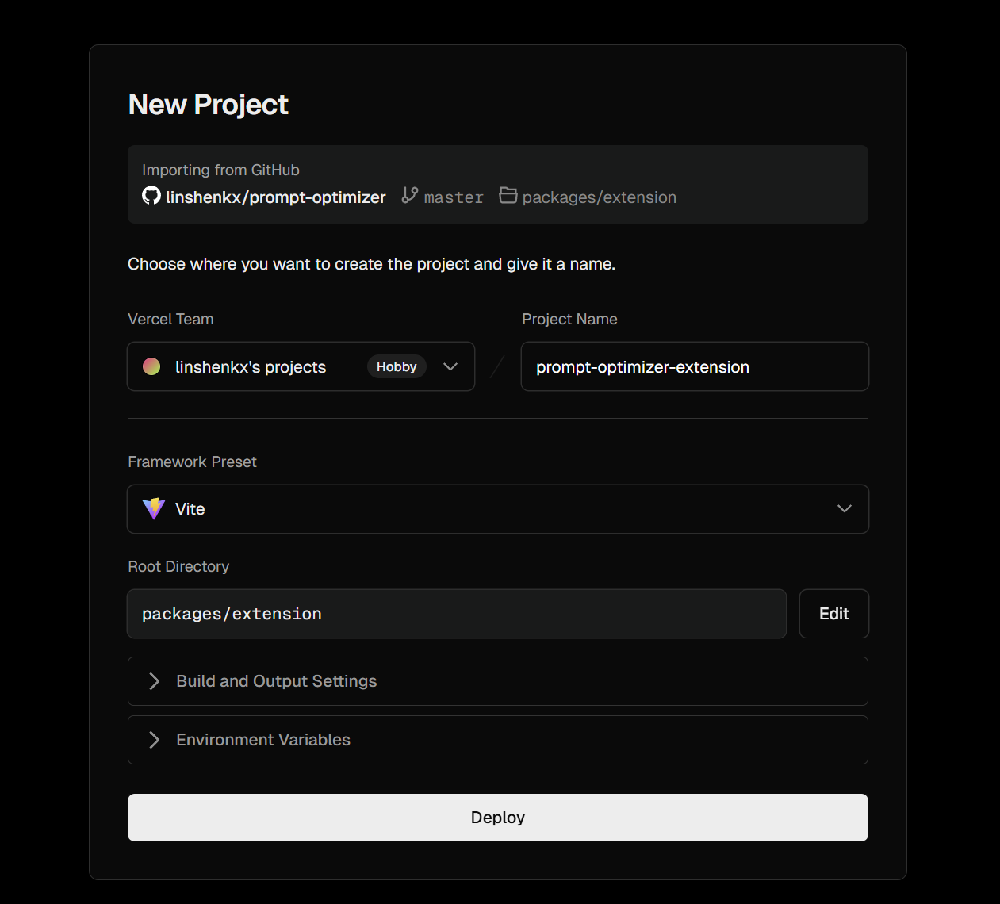
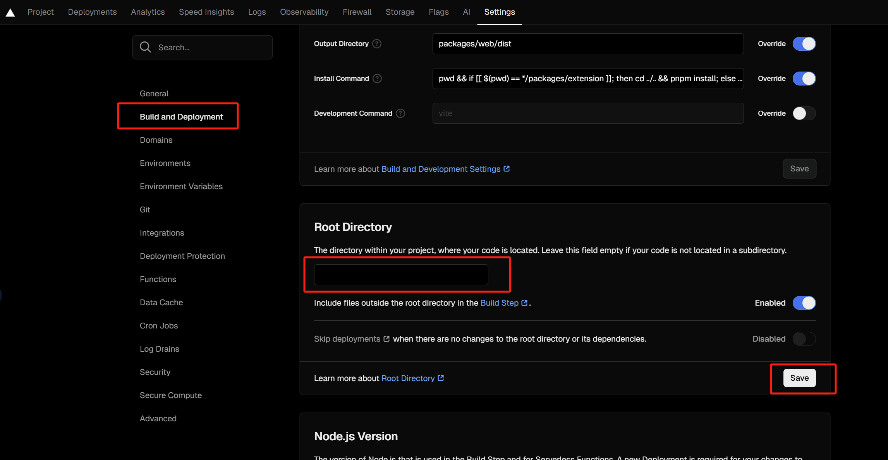
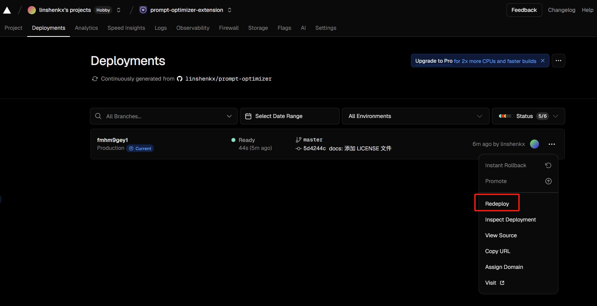

## Vercel Deployment Guide

### Deployment Method Comparison

| Deployment Method | Advantages | Disadvantages |
|---------|------|------|
| One-click Deployment | Quick and convenient, no additional setup required | Cannot automatically sync updates from the source project |
| Fork and Import | Can track source project updates, easier to maintain | First deployment requires manual root directory fix to enable Vercel proxy functionality |

### Recommended Method: Fork the Project and Import to Vercel (Recommended)

This method allows you to track project updates, making it easier to sync the latest features and bug fixes.

1. **Fork the project to your GitHub account**
   - Visit the [prompt-optimizer project](https://github.com/linshenkx/prompt-optimizer)
   - Click the "Fork" button in the top right corner
   - After completing the fork operation, you will have a copy of this project under your GitHub account

2. **Import the project to Vercel**
   - Log in to the [Vercel platform](https://vercel.com/)
   - Click "Add New..." → "Project"
   - Find your forked project in the "Import Git Repository" section and click "Import"
   - Configure the project (**Note**: Although you can set the root directory here, it is ineffective for multi-module projects and will still require manual fixing later)
   - Click "Deploy" to start deployment

   

3. **Fix the root directory setting (Strongly recommended)**
   - When deployed through import, although the project's `vercel.json` file already contains related fixes to make basic functionality work
   - To enable **Vercel proxy functionality** (a key feature for solving cross-origin issues), you need to manually fix the root directory:
   
   a. After the project is deployed, go to project settings
   
   b. Click "Build and Deployment" in the left menu
   
   c. In the "Root Directory" section, **clear** the content in the input box
   
   d. Click "Save" to save the settings
   
   

4. **Redeploy the project**
   - After saving the settings, you need to manually trigger a redeployment to make the fix effective
   - Click "Deployments" in the top navigation bar
   - On the right side of the latest deployment record, click the "..." button
   - Select the "Redeploy" option to trigger redeployment
   
   

5. **Configure environment variables (Optional)**
   - After deployment is complete, go to project settings
   - Click "Environment Variables"
   - Add the required API keys (e.g., `VITE_OPENAI_API_KEY`)
   - Redeploy the project to make the environment variables effective

6. **Sync upstream updates**
   - Open your forked project on GitHub
   - If there are updates, it will show "This branch is X commits behind linshenkx:main"
   - Click the "Sync fork" button to sync the latest changes
   - Vercel will automatically detect code changes and redeploy

### Alternative Method: One-click Deployment to Vercel

If you only need quick deployment and don't care about subsequent updates, you can use the one-click deployment method:

1. Click the button below to deploy directly to Vercel
   

2. Follow Vercel's guidance to complete the deployment process
   
   **Advantage:** With one-click deployment, Vercel can automatically correctly identify the root directory, no manual fixing required, and all features (including Vercel proxy) can work normally.

### About Vercel Proxy Functionality

Prompt Optimizer supports using Edge Runtime proxy to solve cross-origin issues when deployed on Vercel.

1. **Confirm proxy functionality is available**
   - If using one-click deployment: proxy functionality should be directly available
   - If using import deployment: you need to complete the "Fix root directory setting" and "Redeploy" steps mentioned above
   - Open "Model Management" in the application
   - Select the target model -> "Edit", at this point you should see the "Use Vercel Proxy" option
   - If you don't see this option, it means the Vercel Function is not correctly deployed, please check the root directory setting

2. **Enable proxy functionality**
   - Check the "Use Vercel Proxy" option
   - Save the configuration

3. **Proxy principle**
   - Request flow: Browser → Vercel Edge Runtime → Model service provider
   - Solves the cross-origin limitation when browsers directly access APIs
   - Proxy functionality is based on Vercel Function implementation, dependent on the `/api` path

4. **Notes**
   - Some model service providers may restrict requests from Vercel
   - If restrictions are encountered, it is recommended to use a self-deployed API relay service

### Common Issues

1. **Blank page or error after deployment**
   - Check if environment variables are correctly configured
   - View Vercel deployment logs to find the cause of errors

2. **Cannot connect to model API**
   - Confirm the API key is correctly configured
   - Try enabling Vercel proxy functionality
   - Check if the model service provider restricts Vercel requests

3. **"Use Vercel Proxy" option not displayed**
   - If using import deployment: check if you have cleared the root directory setting and redeployed
   - Verify if the `/api/vercel-status` path is accessible (you can test by visiting `your-domain/api/vercel-status` in a browser)
   - Check if there are any Function-related error messages in the deployment logs

4. **How to update a deployed project**
   - If forked and imported: sync the fork and wait for automatic deployment
   - If one-click deployed: need to redeploy the new version (cannot automatically track source project updates)

5. **How to add a custom domain**
   - Select "Domains" in the Vercel project settings
   - Add and verify your domain
   - Follow the guidance to configure DNS records
